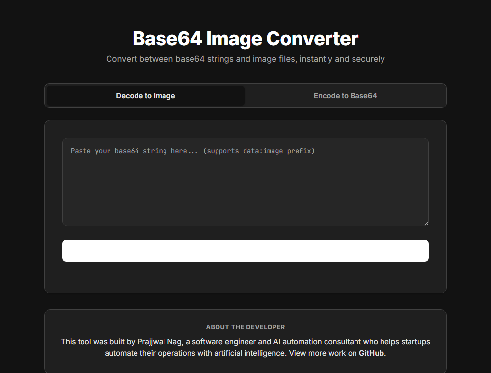

# 🖼️ Base64 Server

A production-ready Base64 image conversion service built with Flask. Convert between base64 strings and image files via a modern web UI or REST API.

[](LICENSE)
[](https://www.python.org/downloads/)
[](https://flask.palletsprojects.com/)
[](CONTRIBUTING.md)
[](https://github.com/prajjwalnag/base64server/stargazers)
[](https://github.com/prajjwalnag/base64server/fork)

> 💡 **Like this project?** Give it a ⭐ star, [fork it](https://github.com/prajjwalnag/base64server/fork), and make it your own. Contributions of any size are welcome — see [CONTRIBUTING.md](CONTRIBUTING.md).



---

## 📁 Project Structure

```
base64/
├── base64server/              # Main Flask application
│   ├── app.py                 # API endpoints & server logic
│   ├── templates/index.html   # Dark-mode web UI
│   ├── requirements.txt       # Python dependencies
│   ├── .gitignore             # Git ignore rules
│   └── README.md              # Full setup & API documentation
├── .github/
│   ├── ISSUE_TEMPLATE/         # Bug report & feature request templates
│   ├── PULL_REQUEST_TEMPLATE.md
│   └── screenshot.png          # App screenshot used in this README
├── LICENSE                     # MIT License
├── CONTRIBUTING.md             # How to contribute
└── README.md                   # This file
```

---

## 🚀 Quick Start

### 1️⃣ Get the Code
```bash
git clone https://github.com/prajjwalnag/base64server.git
cd base64server
```

### 2️⃣ Install & Run
```bash
# Create virtual environment
python -m venv .venv
source .venv/bin/activate  # or .venv\Scripts\activate on Windows

# Install dependencies
pip install -r requirements.txt

# Run the server
python app.py
```

✨ **The app is ready at** `http://localhost:5000`

---

## ✨ Features

| Feature | Description |
|---------|-------------|
| 🎨 **Web Interface** | Dark-mode UI for encoding/decoding images |
| 🔌 **REST API** | Programmatic access with rate limiting |
| 💾 **Two Modes** | Download binary or save to server with URL |
| 🔒 **Security** | Content Security Policy, XSS/clickjacking protection |
| 🧹 **Auto-Cleanup** | Temporary files deleted after 24 hours |
| ⚡ **Rate Limiting** | 30 requests/min per IP to prevent abuse |
| 🖼️ **Format Support** | PNG, JPEG, GIF, WEBP, BMP |

---

## 🤖 Use Case: AI Image Generation Workflows

Many image-generation APIs — including **OpenRouter** and most other LLM/diffusion providers — return generated images as **raw base64 strings** rather than hosted URLs. That's inconvenient when you need to:

- Display the image in a web/mobile app that expects an `` URL
- Share a link to the generated image instead of passing megabytes of base64 around
- Store the image temporarily without standing up your own object storage (S3, GCS, etc.)
- Let downstream services (webhooks, chat UIs, previews) fetch the image over plain HTTP

This server exists to bridge that gap. Point your AI pipeline's base64 output at `/api/v1/decode` with `"mode": "url"`, and get back a shareable link — no cloud storage setup required for quick integrations, demos, or internal tools.

**Typical flow:**

```python
import requests

# 1. Generate an image via OpenRouter (or any image-gen API)
gen_response = requests.post(
    "https://openrouter.ai/api/v1/images/generations",
    headers={"Authorization": "Bearer YOUR_API_KEY"},
    json={"model": "...", "prompt": "a red panda coding at a desk"}
)
base64_image = gen_response.json()["data"][0]["b64_json"]

# 2. Convert it to a URL using this server
url_response = requests.post(
    "http://localhost:5000/api/v1/decode",
    json={"data": base64_image, "mode": "url"}
)
image_url = url_response.json()["url"]

# 3. Use image_url anywhere: chat responses,  tags, webhooks, etc.
print(image_url)
```

This works with output from **any** provider that returns base64-encoded images — OpenRouter, Stability AI, Replicate, self-hosted Stable Diffusion/ComfyUI endpoints, or your own model server. As long as it's base64, this API turns it into a URL.

> ⚠️ Files are stored temporarily (auto-deleted after 24 hours — see [Auto-Cleanup](#-features)). For permanent hosting, pair this with real object storage in production.

---

## 📚 Documentation

For complete setup, deployment, API documentation, and code examples, see:

### 👉 **[base64server/README.md](base64server/README.md)** ← Full Documentation

**Quick Sections:**
- 🔧 Installation & configuration
- 🔌 API endpoints with examples
- 💻 Python, JavaScript, Node.js code samples
- 🐳 Docker & Nginx deployment
- 🆘 Troubleshooting & security info

---

## 🔌 API Endpoints

| Endpoint | Method | Purpose |
|----------|--------|---------|
| `/api/v1/decode` | `POST` | Convert base64 → image |
| `/api/v1/encode` | `POST` | Convert image → base64 |
| `/api/v1/files/<filename>` | `GET` | Download saved file |

**Base URL:** `http://localhost:5000/api/v1`

### ⚡ Quick Example

```bash
# 📤 Encode image to base64
curl -X POST http://localhost:5000/api/v1/encode \
  -F "file=@image.png"

# 📥 Decode base64 to image
curl -X POST http://localhost:5000/api/v1/decode \
  -H "Content-Type: application/json" \
  -d '{"data": "iVBORw0KGgo..."}' \
  -o output.png
```

---

## 🛠️ Development

### 📋 Requirements
- **Python 3.8+** (3.9, 3.10, 3.11, 3.12 supported)
- pip

### ✅ Python Version Support

| Version | Status | Notes |
|---------|--------|-------|
| Python 3.8 | ✅ Supported | Minimum version |
| Python 3.9 | ✅ Supported | Recommended |
| Python 3.10 | ✅ Supported | Fully tested |
| Python 3.11 | ✅ Supported | Fully tested |
| Python 3.12 | ✅ Supported | Latest stable |

### 🔧 Environment Setup

#### Step 1️⃣: Create Virtual Environment

**Windows:**
```bash
python -m venv .venv
```

**macOS/Linux:**
```bash
python3 -m venv .venv
```

#### Step 2️⃣: Activate Virtual Environment

**Windows (Command Prompt):**
```bash
.venv\Scripts\activate
```

**Windows (PowerShell):**
```powershell
.venv\Scripts\Activate.ps1
```

**macOS/Linux (Bash/Zsh):**
```bash
source .venv/bin/activate
```

✅ **After activation, your prompt will show** `(.venv)` prefix

#### Step 3️⃣: Install Dependencies & Run

```bash
pip install -r base64server/requirements.txt
cd base64server
python app.py
```

#### Deactivate Virtual Environment (when done)

```bash
deactivate
```

#### Check Python Version
```bash
python --version
# or
python3 --version
```

#### Install Python 3 (if needed)

**Windows:**
- Download from [python.org](https://www.python.org/downloads/)
- Run installer and check "Add Python to PATH"

**macOS:**
```bash
# Using Homebrew
brew install python3
```

**Linux (Ubuntu/Debian):**
```bash
sudo apt-get update
sudo apt-get install python3 python3-pip python3-venv
```

**Linux (CentOS/RHEL):**
```bash
sudo yum install python3 python3-pip
```

### 🚀 Production Deployment
```bash
pip install gunicorn
gunicorn app:app --bind 0.0.0.0:5000
```

📖 See [base64server/README.md#deployment](base64server/README.md#deployment) for Docker, Nginx, and cloud deployment guides.

---

## 🔒 Security Features

- 🛡️ **Content Security Policy** — Restricts script execution
- ✅ **Magic Byte Validation** — Verifies files by content, not extension
- 🚫 **Rate Limiting** — Protects against brute force & DoS
- 🔐 **XSS Protection** — Safe DOM manipulation
- 🔒 **Clickjacking Prevention** — X-Frame-Options headers
- 🧹 **Auto Cleanup** — Deletes old files automatically

---

## 📊 Stats

- **Lines of Code**: ~800 (backend) + ~400 (frontend)
- **Max File Size**: 20 MB
- **File Retention**: 24 hours
- **Rate Limit**: 30 req/min per IP
- **Supported Formats**: 5 (PNG, JPEG, GIF, WEBP, BMP)

---

## 📄 License

[MIT License](LICENSE) — free to use, modify, and distribute for personal and commercial projects. ✅

---

## 👤 Creator

Built by **Prajjwal Nag** 
*AI Automation Expert | Software Engineer | Entrepreneur*

### 🔗 Connect

[](https://github.com/prajjwalnag)
[](https://www.linkedin.com/in/prajjwalnag/)
[](https://www.instagram.com/mwragency/)
[](https://www.facebook.com/mwragency)

---

## 🤝 Contributing

This project is intentionally small and easy to get into — a great first open-source contribution.

- 🐛 **Report Issues**: [GitHub Issues](https://github.com/prajjwalnag/base64server/issues)
- 💡 **Suggest Features**: Open an issue with your idea
- 🔧 **Submit a PR**: See [CONTRIBUTING.md](CONTRIBUTING.md) for setup, guidelines, and PR checklist

**Good first contributions:**
- Add support for another image format (e.g. SVG, AVIF)
- Add a CLI tool for encode/decode without the web UI
- Write automated tests
- Improve error messages or accessibility

---

## 🍴 Why Fork This?

- **Small, readable codebase** — one `app.py`, one `index.html`, no framework sprawl
- **Real security practices** — CSP headers, magic-byte validation, rate limiting — good reference for your own projects
- **Ready to extend** — add auth, S3 storage, new formats, or a CLI without fighting existing abstractions
- **MIT licensed** — use it commercially, rebrand it, ship it

## ⭐ Show Your Support

If this project helped you, please consider:
- ⭐ **[Star this repo](https://github.com/prajjwalnag/base64server)**
- 🍴 **[Fork it](https://github.com/prajjwalnag/base64server/fork)** and build on it
- 📢 **Share** with others who might find it useful
- 💬 **Give feedback** via [issues](https://github.com/prajjwalnag/base64server/issues)

---

**Made with ❤️ by Prajjwal Nag**

*Last Updated: August 2026*
